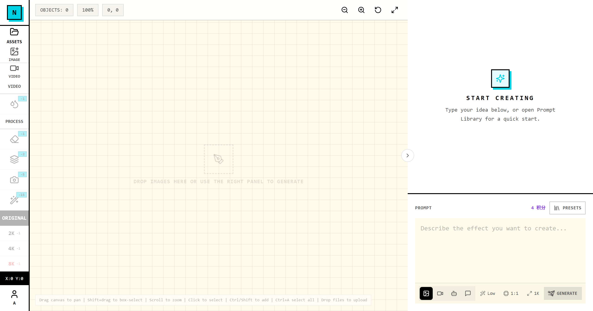
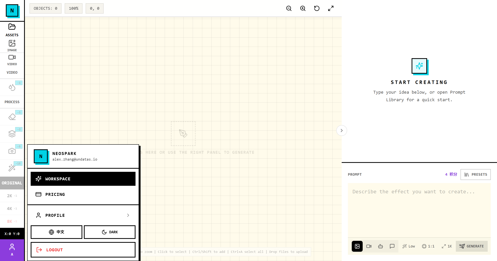
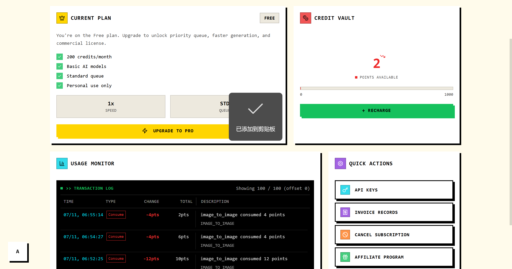
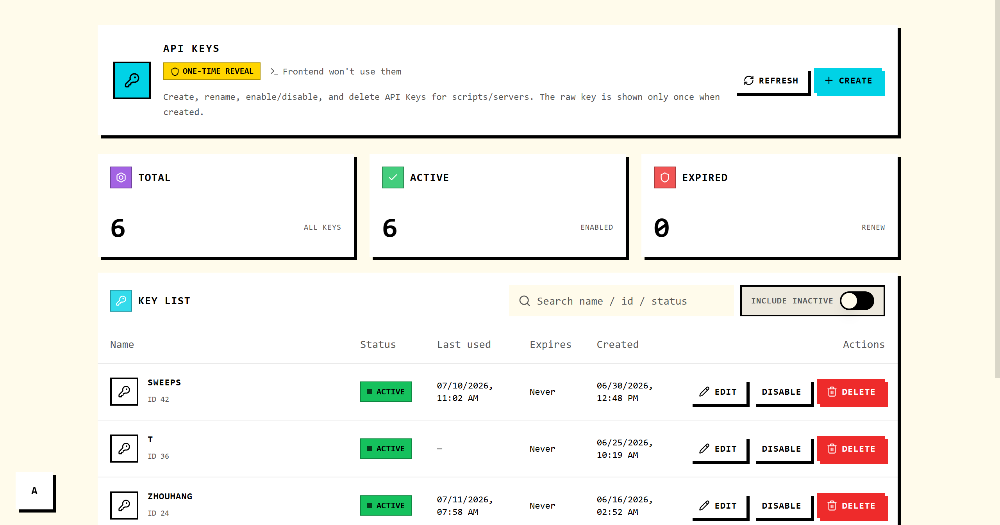
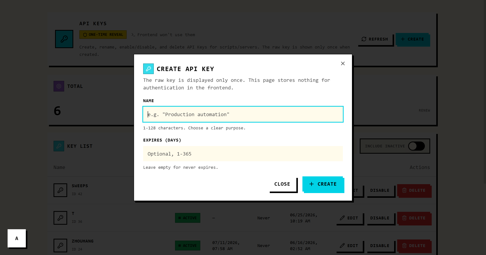

> [中文 README](README.zh.md) | English Version

# NeoSpark CLI (Python)

A cross-platform command-line wrapper for the NeoSpark image generation API. Supports text-to-image, image-to-image, multiple reference images, session management, image download, billing query, and more.

Built on **Python 3.8+**, using the standard libraries `argparse` and `requests`. It can be packaged as a standalone executable via **PyInstaller**, so **end users do not need to install Python**.

---

## Installation

### Option 1: Download the standalone executable (recommended)

Download the binary for your platform from the Releases page:

- Windows: `neospark.exe`
- macOS: `neospark`
- Linux: `neospark`

Place it in your `PATH` and run:

```bash
neospark --version
```

### Option 2: Install via pip (requires Python 3.8+)

```bash
pip install neospark-cli
```

### Option 3: Run from source

```bash
cd neospark_cli
pip install -e .
python -m neospark --version
```

---

## Registration & API Key

Before using NeoSpark CLI, you need a NeoSpark account and an API key.

1. Go to [NeoSpark](https://useneospark.com/) and sign up / log in.
2. In the workspace, click your avatar at the bottom-left to open the menu.
   
3. Select **Profile** to enter the Profile page, then click **API KEYS** in the Quick Actions section.
   
4. On the API Keys page, click **+ CREATE**.
   
5. Enter a name for the key (e.g. `neospark-cli`), optionally set an expiration date, then click **CREATE**.
   
6. The raw API key is shown only once. Click **COPY** and save it securely.
   

> The API key starts with `np_`. Keep it safe — if lost, you must create a new one.

After obtaining the key, proceed to the [Authentication](#authentication) section below.

---

## Authentication

Three methods are supported, with the following priority: command-line argument > environment variable > config file.

```bash
# Option 1: Save to config file
neospark auth login --api-key np_xxxxx

# Option 2: Environment variable
export NEOSPARK_API_KEY=np_xxxxx

# Option 3: Pass per command
neospark models --api-key np_xxxxx
```

---

## Quick Start

### List models and prices

```bash
neospark models
```

### Text-to-image

```bash
neospark generate "a cute cat sitting on a windowsill" \
  --resolution 1K \
  --aspect 1:1 \
  --output ./cat.png
```

> The default model is `gpt-image-2`. To use a Gemini model, specify `--model gemini-3.1-flash-image-preview`. To use Midjourney, specify `--model midjourney` (`1K` resolution only, 25 credits per image). Run `neospark models` for the full list.

### Midjourney

```bash
neospark generate "a cute cat sitting on a windowsill, warm sunlight --ar 16:9" \
  --model midjourney \
  --resolution 1K \
  --aspect 16:9 \
  --output ./cat.png
```

> Midjourney uses the `tengda` provider. The `--quality` option does not apply.

### Image-to-image

```bash
neospark generate "change the background to light gray" \
  --ref ./product.jpg \
  --output ./result.png
```

### Multiple reference images

```bash
neospark generate "blend the styles of these images" \
  --ref ./a.jpg --ref ./b.jpg --ref ./c.jpg \
  --output ./merged.png
```

---

## Command Reference

### `neospark generate <prompt>`

| Option | Default | Description |
|---|---|---|
| `--model` | `gpt-image-2` | Model ID: `gpt-image-2`, `gemini-3.1-flash-image-preview`, `midjourney`, ... |
| `--resolution` | `1K` | `512`, `1K`, `2K`, `3K`, `4K` |
| `--aspect` | `1:1` | Aspect ratio |
| `--negative-prompt` | `""` | Negative prompt |
| `--num-images` | `1` | Number of images to generate (1-4) |
| `--quality` | - | Quality: `low` / `medium` / `high` (gpt-image-2 only) |
| `--ref` | - | Local reference image; can be used multiple times |
| `--ref-url` | - | Reference image URL; can be used multiple times |
| `--strength` | `0.7` | Reference strength 0.0-1.0 |
| `--output` | | Output file path |
| `--output-dir` | | Output directory |
| `--zip` | | Download as ZIP |
| `--no-wait` | | Submit only, do not poll |
| `--session-id` | | Reuse session |

### Other commands

```bash
neospark status <message_id>
neospark images list
neospark images upload ./photo.jpg
neospark images delete up_xxx
neospark sessions list
neospark sessions show ds_xxx
neospark billing
neospark download /uploads/.../cat.png --output ./cat.png
neospark download-zip /uploads/.../a.png /uploads/.../b.png --output ./pack.zip
```

---

## Packaging as a Standalone Executable

### Install development dependencies

```bash
pip install -r requirements-dev.txt
```

### Package with PyInstaller

```bash
pyinstaller neospark.spec
```

Build outputs:

- Windows: `dist/neospark.exe`
- macOS/Linux: `dist/neospark`

---

## Cross-Platform Builds (CI)

You can use GitHub Actions to run `pyinstaller neospark.spec` on Windows, macOS, and Linux, and automatically publish the artifacts to Releases.

---

## Python Version Compatibility

- Development target: Python 3.8+
- Recommended: Python 3.10 / 3.11 / 3.12

---

## Notes

- When using `--ref`, the CLI automatically uploads local images.
- `--ref` and `--ref-url` cannot be used together.
- All list/query commands support `--json` output.

---

## License

MIT
